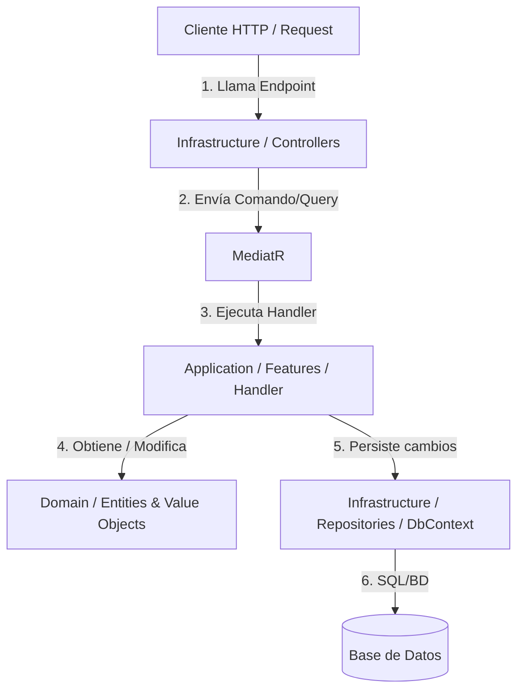

# Guía de Clean Architecture (Monoproyecto) con CQRS y Vertical Slice

Esta guía proporciona las instrucciones detalladas, la estructura y ejemplos de código para implementar **Clean Architecture** dentro de un **único proyecto API en .NET**, utilizando **CQRS (Command Query Responsibility Segregation)** con **Vertical Slices** (rebanadas verticales basadas en características).

---

## 1. Arquitectura y Flujo de Control

Al utilizar un solo proyecto, mantenemos los límites lógicos mediante **carpetas** en lugar de múltiples proyectos en la solución. Esto simplifica enormemente el mantenimiento, reduce el tiempo de compilación y evita dependencias circulares complejas, sin sacrificar la separación de responsabilidades.



### Reglas de Dependencias
Las dependencias fluyen siempre hacia el **interior** (hacia el Dominio):
1. **Dominio (Domain):** No depende de nadie. Es código C# puro (POCO), libre de frameworks, ORMs (como EF Core) o librerías externas.
2. **Aplicación (Application):** Depende únicamente de **Dominio**. Contiene las reglas de negocio de la aplicación (casos de uso) estructuradas en Features (Vertical Slices) usando CQRS.
3. **Infraestructura (Infrastructure):** Depende de **Aplicación** y **Dominio**. Aquí se implementan los detalles técnicos: persistencia (EF Core, Dapper), mensajería, llamadas a APIs externas y también el mecanismo de entrada (Controllers o Minimal APIs).

---

## 2. Estructura de Carpetas del Proyecto

Dentro del proyecto `Api`, organizaremos la estructura de la siguiente manera:

```text
Api/
├── Domain/                           # Capa de Dominio (Modelos de negocio estables)
│   ├── Common/                       # Clases base (Entity, ValueObject, AggregateRoot)
│   ├── Entities/                     # Entidades del negocio (e.g., Product, Customer)
│   ├── ValueObjects/                 # Objetos de Valor inmutables (e.g., Price, Address)
│   ├── Exceptions/                   # Excepciones de negocio/dominio
│   └── Repositories/                 # Contratos (Interfaces) de repositorios
│
├── Application/                      # Capa de Aplicación (Reglas de negocio/Casos de uso)
│   ├── Common/                       # Abstracciones globales y comportamientos (Behaviors)
│   └── Features/                     # Características agrupadas verticalmente (Slices)
│       └── Products/                 # Módulo de Productos
│           ├── CreateProduct/        # Slice Vertical: Crear Producto
│           │   ├── CreateProductCommand.cs
│           │   ├── CreateProductCommandHandler.cs
│           │   ├── CreateProductCommandValidator.cs
│           │   └── ProductResponse.cs
│           └── GetProduct/           # Slice Vertical: Obtener Producto por ID
│               ├── GetProductQuery.cs
│               ├── GetProductQueryHandler.cs
│               └── ProductResponse.cs
│
├── Infrastructure/                   # Capa de Infraestructura (Detalles tecnológicos)
│   ├── Data/                         # Persistencia y base de datos
│   │   ├── ApplicationDbContext.cs   # DbContext de EF Core
│   │   ├── Configurations/           # Mapeos Fluent API de EF Core
│   │   ├── Migrations/               # Migraciones de EF Core
│   │   └── Repositories/             # Implementación de los repositorios
│   ├── Services/                     # Implementación de servicios externos (Email, API clientes)
│   └── Controllers/                  # Controladores de la API (Punto de entrada técnico)
│       └── ProductsController.cs     # Controlador para despachar peticiones de Products
│
└── Program.cs                        # Registro de dependencias y pipeline HTTP
```

---

## 3. Ejemplo de Código Completo

A continuación, se detalla un flujo completo para la entidad **Product** estructurado según esta arquitectura.

### 3.1. Capa de Dominio

#### Clase Base Entity (`Entity.cs`)
Esta clase base proporciona la infraestructura reutilizable para la identidad y la igualdad de las entidades, evitando tener implementaciones redundantes.
```csharp
namespace Api.Domain.Common;

public abstract class Entity<TId> where TId : notnull
{
    public TId Id { get; protected set; } = default!;

    protected Entity() { }

    protected Entity(TId id)
    {
        Id = id;
    }

    public override bool Equals(object? obj)
    {
        if (obj is not Entity<TId> other)
            return false;

        if (ReferenceEquals(this, other))
            return true;

        if (GetType() != other.GetType())
            return false;

        return Id.Equals(other.Id);
    }

    public override int GetHashCode()
    {
        return Id.GetHashCode();
    }

    public static bool operator ==(Entity<TId>? a, Entity<TId>? b)
    {
        if (a is null && b is null)
            return true;

        if (a is null || b is null)
            return false;

        return a.Equals(b);
    }

    public static bool operator !=(Entity<TId>? a, Entity<TId>? b)
    {
        return !(a == b);
    }
}
```

#### Objeto de Valor (`Price.cs`)
Representado con la librería Vogen. Es un struct inmutable autogenerado.
```csharp
using Vogen;

namespace Api.Domain.ValueObjects;

[ValueObject<decimal>]
public partial struct Price
{
    private static Validation Validate(decimal value) =>
        value < 0
            ? Validation.Invalid("El precio no puede ser negativo.")
            : Validation.Ok;
}
```

#### Entidad (`Product.cs`)
La entidad hereda de la clase base reutilizable `Entity<Guid>` y utiliza el objeto de valor de Vogen.
```csharp
using Api.Domain.Common;
using Api.Domain.ValueObjects;

namespace Api.Domain.Entities;

public class Product : Entity<Guid>
{
    public string Name { get; private set; } = null!;
    public Price Price { get; private set; }
    public DateTime CreatedAt { get; private set; }

    // Constructor privado para EF Core
    private Product() { }

    public Product(Guid id, string name, Price price) : base(id)
    {
        if (string.IsNullOrWhiteSpace(name))
            throw new ArgumentException("El nombre del producto no puede estar vacío.", nameof(name));

        Name = name;
        Price = price;
        CreatedAt = DateTime.UtcNow;
    }

    // Regla de negocio expuesta a través de un método (comportamiento)
    public void UpdatePrice(Price newPrice)
    {
        Price = newPrice;
    }
}
```


#### Interfaz de Repositorio (`IProductRepository.cs`)
El contrato se define en el Dominio para que la Aplicación pueda consumirlo sin saber cómo se persiste (Inversión de Dependencias).
```csharp
using Api.Domain.Entities;

namespace Api.Domain.Repositories;

public interface IProductRepository
{
    Task<Product?> GetByIdAsync(Guid id, CancellationToken cancellationToken = default);
    Task AddAsync(Product product, CancellationToken cancellationToken = default);
    Task SaveChangesAsync(CancellationToken cancellationToken = default);
}
```

#### Objeto de Valor (`Email.cs`)
El email encapsula las invariantes de validación del formato de correo electrónico y normaliza su valor.
```csharp
namespace Api.Domain.ValueObjects;

public record Email
{
    public string Value { get; }

    private Email(string value)
    {
        if (string.IsNullOrWhiteSpace(value))
            throw new ArgumentException("El correo electrónico no puede estar vacío.", nameof(value));

        if (!value.Contains("@") || !value.Contains("."))
            throw new ArgumentException("El correo electrónico no tiene un formato válido.", nameof(value));

        Value = value.ToLowerInvariant().Trim();
    }

    public static Email Create(string value)
    {
        return new Email(value);
    }
}
```

#### Entidad (`Usuario.cs`)
La entidad de usuario representa la identidad y los datos de un usuario en el sistema.
```csharp
using Api.Domain.ValueObjects;

namespace Api.Domain.Entities;

public class Usuario
{
    public Guid Id { get; private set; }
    public string Nombre { get; private set; } = null!;
    public string Apellido { get; private set; } = null!;
    public Email Email { get; private set; } = null!;
    public DateTime CreadoEn { get; private set; }

    // Constructor privado para requerimientos de ORM (Entity Framework Core)
    private Usuario() { }

    public Usuario(Guid id, string nombre, string apellido, Email email)
    {
        if (string.IsNullOrWhiteSpace(nombre))
            throw new ArgumentException("El nombre no puede estar vacío.", nameof(nombre));

        if (string.IsNullOrWhiteSpace(apellido))
            throw new ArgumentException("El apellido no puede estar vacío.", nameof(apellido));

        ArgumentNullException.ThrowIfNull(email);

        Id = id;
        Nombre = nombre;
        Apellido = apellido;
        Email = email;
        CreadoEn = DateTime.UtcNow;
    }

    // Comportamiento del dominio para actualizar los datos del usuario
    public void ActualizarDatos(string nombre, string apellido, Email email)
    {
        if (string.IsNullOrWhiteSpace(nombre))
            throw new ArgumentException("El nombre no puede estar vacío.", nameof(nombre));

        if (string.IsNullOrWhiteSpace(apellido))
            throw new ArgumentException("El apellido no puede estar vacío.", nameof(apellido));

        ArgumentNullException.ThrowIfNull(email);

        Nombre = nombre;
        Apellido = apellido;
        Email = email;
    }
}
```

---


### 3.2. Capa de Aplicación (CQRS & Vertical Slice)

Cada caso de uso está auto-contenido dentro de su propia carpeta de característica (`Feature`). Se utiliza `MediatR` para desacoplar el controlador de la lógica de negocio.

#### Comando (`CreateProductCommand.cs`)
Define los datos necesarios para ejecutar la acción.
```csharp
using MediatR;

namespace Api.Application.Features.Products.CreateProduct;

public record CreateProductCommand(string Name, decimal PriceValue, string Currency) : IRequest<Guid>;
```

#### Validador (`CreateProductCommandValidator.cs`)
Utiliza `FluentValidation` para validar los parámetros de entrada antes de que lleguen al handler.
```csharp
using FluentValidation;

namespace Api.Application.Features.Products.CreateProduct;

public class CreateProductCommandValidator : AbstractValidator<CreateProductCommand>
{
    public CreateProductCommandValidator()
    {
        RuleFor(x => x.Name)
            .NotEmpty().WithMessage("El nombre es requerido.")
            .MaximumLength(100).WithMessage("El nombre no debe exceder 100 caracteres.");

        RuleFor(x => x.PriceValue)
            .GreaterThan(0).WithMessage("El precio debe ser mayor a cero.");

        RuleFor(x => x.Currency)
            .NotEmpty().WithMessage("La moneda es requerida.")
            .Length(3).WithMessage("La moneda debe tener un formato ISO de 3 letras (e.g. USD).");
    }
}
```

#### Handler (`CreateProductCommandHandler.cs`)
Contiene la orquestación del caso de uso. Recibe el comando, interactúa con el Dominio y persiste usando la interfaz del repositorio.
```csharp
using Api.Domain.Entities;
using Api.Domain.Repositories;
using Api.Domain.ValueObjects;
using MediatR;

namespace Api.Application.Features.Products.CreateProduct;

public class CreateProductCommandHandler(IProductRepository repository) 
    : IRequestHandler<CreateProductCommand, Guid>
{
    private readonly IProductRepository _repository = repository;

    public async Task<Guid> Handle(CreateProductCommand request, CancellationToken cancellationToken)
    {
        // 1. Crear objetos de valor y entidad
        var price = Price.Create(request.PriceValue, request.Currency);
        var product = new Product(Guid.NewGuid(), request.Name, price);

        // 2. Ejecutar persistencia
        await _repository.AddAsync(product, cancellationToken);
        await _repository.SaveChangesAsync(cancellationToken);

        // 3. Retornar ID de la entidad creada
        return product.Id;
    }
}
```

---

### 3.3. Capa de Infraestructura

#### Base de Datos (`ApplicationDbContext.cs`)
```csharp
using Api.Domain.Entities;
using Microsoft.EntityFrameworkCore;

namespace Api.Infrastructure.Data;

public class ApplicationDbContext : DbContext
{
    public ApplicationDbContext(DbContextOptions<ApplicationDbContext> options) : base(options) { }

    public DbSet<Product> Products => Set<Product>();

    protected override void OnModelCreating(ModelBuilder modelBuilder)
    {
        // Configuraciones Fluent API
        modelBuilder.Entity<Product>(builder =>
        {
            builder.ToTable("Products");
            builder.HasKey(p => p.Id);
            builder.Property(p => p.Name).HasMaxLength(100).IsRequired();

            // Mapeo del Value Object 'Price' como columna de propiedad adosada (Owned Types)
            builder.OwnsOne(p => p.Price, price =>
            {
                price.Property(p => p.Value).HasColumnName("Price").HasPrecision(18, 2).IsRequired();
                price.Property(p => p.Currency).HasColumnName("Currency").HasMaxLength(3).IsRequired();
            });
        });
    }
}
```

#### Repositorio (`ProductRepository.cs`)
Implementación concreta de la base de datos que se ubica en Infraestructura.
```csharp
using Api.Domain.Entities;
using Api.Domain.Repositories;
using Api.Infrastructure.Data;
using Microsoft.EntityFrameworkCore;

namespace Api.Infrastructure.Data.Repositories;

public class ProductRepository(ApplicationDbContext dbContext) : IProductRepository
{
    private readonly ApplicationDbContext _dbContext = dbContext;

    public async Task<Product?> GetByIdAsync(Guid id, CancellationToken cancellationToken = default)
    {
        return await _dbContext.Products
            .FirstOrDefaultAsync(p => p.Id == id, cancellationToken);
    }

    public async Task AddAsync(Product product, CancellationToken cancellationToken = default)
    {
        await _dbContext.Products.AddAsync(product, cancellationToken);
    }

    public async Task SaveChangesAsync(CancellationToken cancellationToken = default)
    {
        await _dbContext.SaveChangesAsync(cancellationToken);
    }
}
```

#### Controlador API (`ProductsController.cs`)
Actúa puramente como despachador HTTP. Recibe peticiones HTTP, delega a `MediatR` y retorna el código de estado correspondiente.
```csharp
using Api.Application.Features.Products.CreateProduct;
using MediatR;
using Microsoft.AspNetCore.Mvc;

namespace Api.Infrastructure.Controllers;

[ApiController]
[Route("api/[controller]")]
public class ProductsController(ISender sender) : ControllerBase
{
    private readonly ISender _sender = sender;

    [HttpPost]
    [ProducesResponseType(StatusCodes.Status201Created)]
    [ProducesResponseType(StatusCodes.Status400BadRequest)]
    public async Task<IActionResult> Create([FromBody] CreateProductCommand command, CancellationToken cancellationToken)
    {
        var productId = await _sender.Send(command, cancellationToken);
        return CreatedAtAction(nameof(Create), new { id = productId }, productId);
    }
}
```

---

## 4. Configuración en `Program.cs`

Para que todo funcione coordinadamente con .NET Aspire 13+ y cargue las semillas con Bogus, el archivo `Program.cs` se configura de la siguiente forma:

```csharp
using Api.Domain.Repositories;
using Api.Infrastructure.Data;
using Api.Infrastructure.Data.Repositories;
using FluentValidation;

var builder = WebApplication.CreateBuilder(args);

// 1. Agregar Controladores y OpenAPI
builder.Services.AddControllers();
builder.Services.AddOpenApi();

// 2. Configurar la persistencia de SQL Server con la integración nativa de .NET Aspire 13+
builder.AddSqlServerDbContext<ApplicationDbContext>("bd");

// 3. Registrar el repositorio de usuarios
builder.Services.AddScoped<IUsuarioRepository, UsuarioRepository>();

// 4. Registrar MediatR
builder.Services.AddMediatR(cfg =>
{
    cfg.RegisterServicesFromAssembly(typeof(Program).Assembly);
});

// 5. Registrar FluentValidation
builder.Services.AddValidatorsFromAssembly(typeof(Program).Assembly);

var app = builder.Build();

// 6. Ejecutar base de datos y Seeds (Seeder con Bogus) en el inicio de la aplicación
using (var scope = app.Services.CreateScope())
{
    var context = scope.ServiceProvider.GetRequiredService<ApplicationDbContext>();
    DbSeeder.Seed(context);
}

// Configurar el pipeline HTTP
if (app.Environment.IsDevelopment())
{
    app.MapOpenApi();
}

app.UseHttpsRedirection();
app.UseAuthorization();
app.MapControllers();

app.Run();
```


---

## 5. Beneficios Clave de esta Estructura

1. **Localidad del Cambio:** Si necesitas agregar un nuevo campo a la creación del producto, no tienes que navegar por 4 proyectos distintos. Abres la carpeta `Application/Features/Products/CreateProduct` y allí tienes el Comando, el Validador y el Handler juntos.
2. **Desacoplamiento Máximo:** Cada *Slice* (Caso de Uso) es independiente. El código de crear productos no se mezcla con el de obtener o eliminar productos.
3. **Escalabilidad del Código:** A medida que la aplicación crece, simplemente agregas más carpetas bajo `Features/`, manteniendo la base de código limpia y auto-explicativa.
4. **Cero Overhead de Proyectos:** Al ser un único proyecto C#, la compilación es sumamente veloz y la gestión de dependencias NuGet se realiza en un solo lugar.
