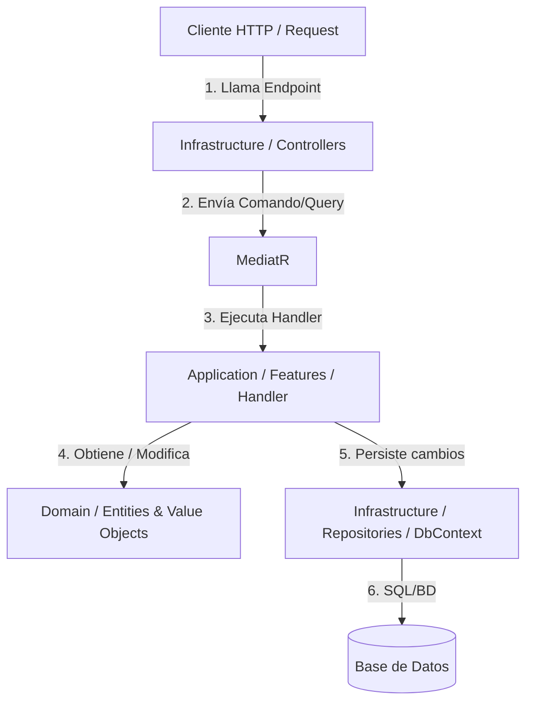

# Guía de Clean Architecture (Monoproyecto) con CQRS y Vertical Slice

Esta guía proporciona las instrucciones detalladas, la estructura y ejemplos de código para implementar **Clean Architecture** dentro de un **único proyecto API en .NET**, utilizando **CQRS (Command Query Responsibility Segregation)** con **Vertical Slices** (rebanadas verticales basadas en características).

---

## 1. Arquitectura y Flujo de Control

Al utilizar un solo proyecto, mantenemos los límites lógicos mediante **carpetas** en lugar de múltiples proyectos en la solución. Esto simplifica enormemente el mantenimiento, reduce el tiempo de compilación y evita dependencias circulares complejas, sin sacrificar la separación de responsabilidades.



### Reglas de Dependencias
Las dependencias fluyen siempre hacia el **interior** (hacia el Dominio):
1. **Dominio (Domain):** No depende de nadie. Es código C# puro (POCO), libre de frameworks, ORMs (como EF Core) o librerías externas.
2. **Aplicación (Application):** Depende únicamente de **Dominio**. Contiene las reglas de negocio de la aplicación (casos de uso) estructuradas en Features (Vertical Slices) usando CQRS.
3. **Infraestructura (Infrastructure):** Depende de **Aplicación** y **Dominio**. Aquí se implementan los detalles técnicos: persistencia (EF Core, Dapper), mensajería, llamadas a APIs externas y también el mecanismo de entrada (Controllers o Minimal APIs).

---

## 2. Estructura de Carpetas del Proyecto

Dentro del proyecto `Api`, organizaremos la estructura de la siguiente manera:

```text
Api/
├── Domain/                           # Capa de Dominio (Modelos de negocio estables)
│   ├── Common/                       # Clases base (Entity)
│   ├── Entities/                     # Entidades del negocio (e.g., Usuario)
│   └── ValueObjects/                 # Objetos de Valor de Vogen (e.g., Email)
│
├── Application/                      # Capa de Aplicación (Casos de uso en Slices)
│   ├── Common/                       # Utilidades globales (IEndpoint, EndpointExtensions, ValidationFilter)
│   └── Features/                     # Rebanadas Verticales (Auto-contenidas en un solo archivo C#)
│       └── Usuarios/                 # Módulo de Usuarios
│           ├── CreateUsuario/
│           │   └── CreateUsuario.cs  # Contiene Command, Validator, Handler y Endpoint
│           └── GetUsuarios/
│               └── GetUsuarios.cs    # Contiene Query, DTO Response, Handler y Endpoint
│
├── Infrastructure/                   # Capa de Infraestructura (Detalles de persistencia y Aspire)
│   └── Data/                         # Persistencia y base de datos
│       ├── ApplicationDbContext.cs   # DbContext de EF Core
│       └── DbSeeder.cs               # Generador de Semillas con Bogus
│
└── Program.cs                        # Registro de dependencias de Aspire, MediatR y Minimal APIs
```


---

## 3. Ejemplo de Código Completo

A continuación, se detalla la implementación completa para el módulo de **Usuarios** estructurado según esta arquitectura.

### 3.1. Capa de Dominio

#### Clase Base Entity (`Entity.cs`)
```csharp
namespace Api.Domain.Common;

public abstract class Entity<TId> where TId : notnull
{
    public TId Id { get; protected set; } = default!;

    protected Entity() { }

    protected Entity(TId id)
    {
        Id = id;
    }

    public override bool Equals(object? obj)
    {
        if (obj is not Entity<TId> other)
            return false;

        if (ReferenceEquals(this, other))
            return true;

        if (GetType() != other.GetType())
            return false;

        return Id.Equals(other.Id);
    }

    public override int GetHashCode()
    {
        return Id.GetHashCode();
    }

    public static bool operator ==(Entity<TId>? a, Entity<TId>? b)
    {
        if (a is null && b is null)
            return true;

        if (a is null || b is null)
            return false;

        return a.Equals(b);
    }

    public static bool operator !=(Entity<TId>? a, Entity<TId>? b)
    {
        return !(a == b);
    }
}
```

#### Objeto de Valor con Vogen (`Email.cs`)
```csharp
using Vogen;

namespace Api.Domain.ValueObjects;

[ValueObject<string>]
public partial struct Email
{
    private static Validation Validate(string value)
    {
        if (string.IsNullOrWhiteSpace(value))
        {
            return Validation.Invalid("El correo electrónico no puede estar vacío.");
        }

        if (!value.Contains("@") || !value.Contains("."))
        {
            return Validation.Invalid("El correo electrónico no tiene un formato válido.");
        }

        return Validation.Ok;
    }
}
```

#### Entidad (`Usuario.cs`)
```csharp
using Api.Domain.Common;
using Api.Domain.ValueObjects;

namespace Api.Domain.Entities;

public class Usuario : Entity<Guid>
{
    public string Nombre { get; private set; } = null!;
    public string Apellido { get; private set; } = null!;
    public Email Email { get; private set; }
    public DateTime CreadoEn { get; private set; }

    private Usuario() { }

    public Usuario(Guid id, string nombre, string apellido, Email email) : base(id)
    {
        if (string.IsNullOrWhiteSpace(nombre))
            throw new ArgumentException("El nombre no puede estar vacío.", nameof(nombre));

        if (string.IsNullOrWhiteSpace(apellido))
            throw new ArgumentException("El apellido no puede estar vacío.", nameof(apellido));

        Nombre = nombre;
        Apellido = apellido;
        Email = email;
        CreadoEn = DateTime.UtcNow;
    }

    public void ActualizarDatos(string nombre, string apellido, Email email)
    {
        if (string.IsNullOrWhiteSpace(nombre))
            throw new ArgumentException("El nombre no puede estar vacío.", nameof(nombre));

        if (string.IsNullOrWhiteSpace(apellido))
            throw new ArgumentException("El apellido no puede estar vacío.", nameof(apellido));

        Nombre = nombre;
        Apellido = apellido;
        Email = email;
    }
}
```

---

### 3.2. Capa de Aplicación (CQRS & Vertical Slice en un solo archivo)

Para evitar la dispersión de archivos y mantener la cohesión, el comando/query, el validador, el handler y el endpoint se ubican en el **mismo archivo de característica**.

#### Interfaz para Registro de Endpoints (`IEndpoint.cs`)
```csharp
using Microsoft.AspNetCore.Routing;

namespace Api.Application.Common;

public interface IEndpoint
{
    void MapEndpoint(IEndpointRouteBuilder app);
}
```

#### Filtro de Validación Genérico (`ValidationFilter.cs`)
```csharp
using FluentValidation;
using Microsoft.AspNetCore.Http;
using Microsoft.Extensions.DependencyInjection;

namespace Api.Application.Common;

public class ValidationFilter<T> : IEndpointFilter where T : class
{
    public async ValueTask<object?> InvokeAsync(EndpointFilterInvocationContext context, EndpointFilterDelegate next)
    {
        var validator = context.HttpContext.RequestServices.GetService<IValidator<T>>();
        
        if (validator is not null)
        {
            var arg = context.Arguments.FirstOrDefault(x => x is T) as T;
            if (arg is not null)
            {
                var validationResult = await validator.ValidateAsync(arg);
                if (!validationResult.IsValid)
                {
                    return Results.ValidationProblem(validationResult.ToDictionary());
                }
            }
        }
        
        return await next(context);
    }
}

public static class RouteHandlerBuilderExtensions
{
    public static RouteHandlerBuilder WithValidation<T>(this RouteHandlerBuilder builder) where T : class
    {
        return builder.AddEndpointFilter<ValidationFilter<T>>();
    }
}
```

#### Rebanada Vertical: Crear Usuario (`CreateUsuario.cs`)
```csharp
using Api.Application.Common;
using Api.Domain.Entities;
using Api.Domain.ValueObjects;
using Api.Infrastructure.Data;
using FluentValidation;
using MediatR;
using Microsoft.AspNetCore.Builder;
using Microsoft.AspNetCore.Http;
using Microsoft.AspNetCore.Routing;

namespace Api.Application.Features.Usuarios.CreateUsuario;

public record CreateUsuarioCommand(string Nombre, string Apellido, string Email) : IRequest<Guid>;

public class CreateUsuarioCommandValidator : AbstractValidator<CreateUsuarioCommand>
{
    public CreateUsuarioCommandValidator()
    {
        RuleFor(x => x.Nombre).NotEmpty().MaximumLength(100);
        RuleFor(x => x.Apellido).NotEmpty().MaximumLength(100);
        RuleFor(x => x.Email).NotEmpty().Must(email => email.Contains("@") && email.Contains("."));
    }
}

public class CreateUsuarioCommandHandler(ApplicationDbContext context) 
    : IRequestHandler<CreateUsuarioCommand, Guid>
{
    public async Task<Guid> Handle(CreateUsuarioCommand request, CancellationToken cancellationToken)
    {
        var email = Email.From(request.Email);
        var usuario = new Usuario(Guid.NewGuid(), request.Nombre, request.Apellido, email);

        await context.Usuarios.AddAsync(usuario, cancellationToken);
        await context.SaveChangesAsync(cancellationToken);

        return usuario.Id;
    }
}

public class CreateUsuarioEndpoint : IEndpoint
{
    public void MapEndpoint(IEndpointRouteBuilder app)
    {
        app.MapPost("api/usuarios", async (CreateUsuarioCommand command, ISender sender, CancellationToken cancellationToken) =>
        {
            var id = await sender.Send(command, cancellationToken);
            return Results.Created($"/api/usuarios/{id}", id);
        })
        .WithName("CreateUsuario")
        .WithTags("Usuarios")
        .WithValidation<CreateUsuarioCommand>()
        .Produces<Guid>(StatusCodes.Status201Created)
        .ProducesValidationProblem(StatusCodes.Status400BadRequest);
    }
}
```

#### Rebanada Vertical: Obtener Usuarios (`GetUsuarios.cs`)
```csharp
using Api.Application.Common;
using Api.Infrastructure.Data;
using MediatR;
using Microsoft.AspNetCore.Builder;
using Microsoft.AspNetCore.Http;
using Microsoft.AspNetCore.Routing;
using Microsoft.EntityFrameworkCore;

namespace Api.Application.Features.Usuarios.GetUsuarios;

public record UsuarioResponse(Guid Id, string Nombre, string Apellido, string Email, DateTime CreadoEn);

public record GetUsuariosQuery : IRequest<List<UsuarioResponse>>;

public class GetUsuariosQueryHandler(ApplicationDbContext context) 
    : IRequestHandler<GetUsuariosQuery, List<UsuarioResponse>>
{
    public async Task<List<UsuarioResponse>> Handle(GetUsuariosQuery request, CancellationToken cancellationToken)
    {
        var usuarios = await context.Usuarios.ToListAsync(cancellationToken);
        
        return usuarios.Select(u => new UsuarioResponse(
            u.Id,
            u.Nombre,
            u.Apellido,
            u.Email.Value,
            u.CreadoEn
        )).ToList();
    }
}

public class GetUsuariosEndpoint : IEndpoint
{
    public void MapEndpoint(IEndpointRouteBuilder app)
    {
        app.MapGet("api/usuarios", async (ISender sender, CancellationToken cancellationToken) =>
        {
            var result = await sender.Send(new GetUsuariosQuery(), cancellationToken);
            return Results.Ok(result);
        })
        .WithName("GetUsuarios")
        .WithTags("Usuarios")
        .Produces<List<UsuarioResponse>>(StatusCodes.Status200OK);
    }
}
```


---

### 3.3. Capa de Infraestructura

#### Base de Datos (`ApplicationDbContext.cs`)
```csharp
using Api.Domain.Entities;
using Api.Domain.ValueObjects;
using Microsoft.EntityFrameworkCore;

namespace Api.Infrastructure.Data;

public class ApplicationDbContext : DbContext
{
    public ApplicationDbContext(DbContextOptions<ApplicationDbContext> options) : base(options) { }

    public DbSet<Usuario> Usuarios => Set<Usuario>();

    protected override void OnModelCreating(ModelBuilder modelBuilder)
    {
        modelBuilder.Entity<Usuario>(builder =>
        {
            builder.ToTable("Usuarios");
            builder.HasKey(u => u.Id);
            builder.Property(u => u.Nombre).HasMaxLength(100).IsRequired();
            builder.Property(u => u.Apellido).HasMaxLength(100).IsRequired();

            // Configurar conversión para el value object de Vogen
            builder.Property(u => u.Email)
                .HasConversion(
                    email => email.Value,
                    value => Email.From(value))
                .HasColumnName("Email")
                .HasMaxLength(255)
                .IsRequired();
        });
    }
}
```

#### Semillas con Bogus (`DbSeeder.cs`)
```csharp
using Api.Domain.Entities;
using Api.Domain.ValueObjects;
using Bogus;

namespace Api.Infrastructure.Data;

public static class DbSeeder
{
    public static void Seed(ApplicationDbContext context)
    {
        context.Database.EnsureCreated();

        if (context.Usuarios.Any()) return;

        var faker = new Faker<Usuario>()
            .CustomInstantiator(f =>
            {
                var nombre = f.Name.FirstName();
                var apellido = f.Name.LastName();
                var email = Email.From(f.Internet.Email(nombre, apellido));
                return new Usuario(Guid.NewGuid(), nombre, apellido, email);
            });

        context.Usuarios.AddRange(faker.Generate(10));
        context.SaveChanges();
    }
}
```

---


## 4. Configuración en `Program.cs`

Para que todo funcione coordinadamente con .NET Aspire 13+ y cargue las semillas con Bogus, el archivo `Program.cs` se configura de la siguiente forma:

```csharp
using Api.Application.Common;
using Api.Infrastructure.Data;
using FluentValidation;

var builder = WebApplication.CreateBuilder(args);

// 1. Agregar OpenAPI y dependencias de endpoints automáticos (Minimal APIs)
builder.Services.AddOpenApi();
builder.Services.AddEndpoints();

// 2. Configurar la persistencia de SQL Server con la integración nativa de .NET Aspire 13+
if (!builder.Environment.IsEnvironment("Testing"))
{
    builder.AddSqlServerDbContext<ApplicationDbContext>("bd");
}

// 3. Registrar MediatR
builder.Services.AddMediatR(cfg =>
{
    cfg.RegisterServicesFromAssembly(typeof(Program).Assembly);
});

// 4. Registrar FluentValidation
builder.Services.AddValidatorsFromAssembly(typeof(Program).Assembly);

var app = builder.Build();

// 5. Ejecutar base de datos y Seeds (Seeder con Bogus) en el inicio de la aplicación
if (!app.Environment.IsEnvironment("Testing"))
{
    using var scope = app.Services.CreateScope();
    var context = scope.ServiceProvider.GetRequiredService<ApplicationDbContext>();
    DbSeeder.Seed(context);
}

// Configurar el pipeline HTTP
if (app.Environment.IsDevelopment())
{
    app.MapOpenApi();
}

app.UseHttpsRedirection();
app.UseAuthorization();

// 6. Mapear automáticamente todas las Minimal APIs (Vertical Slices)
app.MapEndpoints();

app.Run();
```

---

## 5. Pruebas Funcionales

La suite funcional vive en `Api.FunctionalTests/` y separa claramente bootstrap, datos fake y casos reales:

- `Infrastructure/SqliteTestDatabase.cs` recrea la base antes de cada test.
- `Infrastructure/ApiWebApplicationFactory.cs` reemplaza el `DbContext` del API para que la app corra dentro del test host.
- `Infrastructure/UsuarioBogusFactory.cs` centraliza los datos fake con `Bogus`.
- `Queries/GetUsuariosTests.cs` agrupa los casos de lectura y paginación.
- `Queries/GetUsuarioByIdTests.cs` valida la búsqueda puntual por id y sus edge cases.
- `Commands/CreateUsuarioTests.cs` agrupa los casos de escritura y validación.
- `Infrastructure/ApiFunctionalTestBase.cs` concentra el bootstrap compartido.

Este enfoque valida el pipeline completo de cada feature: request HTTP, binding, validación, MediatR, persistencia y respuesta.

Cuando el API arranca en `Testing`, `Program.cs` omite la configuración de SQL Server y el seeding de inicio. Eso permite que la suite de pruebas sustituya la persistencia sin interferir con la configuración de producción.


---
## 5. Beneficios Clave de esta Estructura

1. **Localidad del Cambio:** Si necesitas agregar un nuevo campo a la creación del producto, no tienes que navegar por 4 proyectos distintos. Abres la carpeta `Application/Features/Products/CreateProduct` y allí tienes el Comando, el Validador y el Handler juntos.
2. **Desacoplamiento Máximo:** Cada *Slice* (Caso de Uso) es independiente. El código de crear productos no se mezcla con el de obtener o eliminar productos.
3. **Escalabilidad del Código:** A medida que la aplicación crece, simplemente agregas más carpetas bajo `Features/`, manteniendo la base de código limpia y auto-explicativa.
4. **Cero Overhead de Proyectos:** Al ser un único proyecto C#, la compilación es sumamente veloz y la gestión de dependencias NuGet se realiza en un solo lugar.
